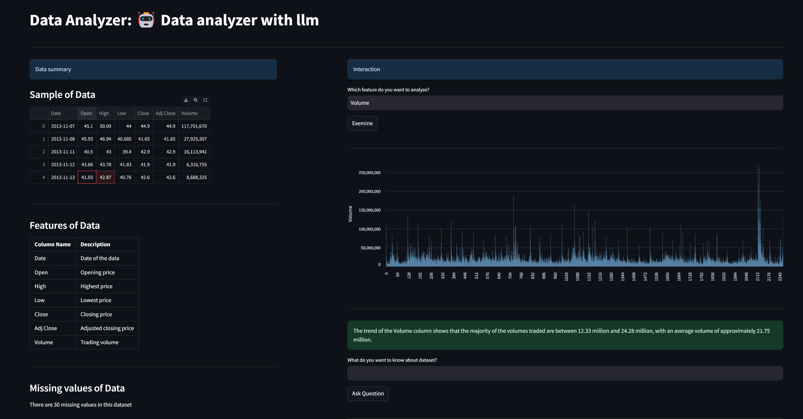
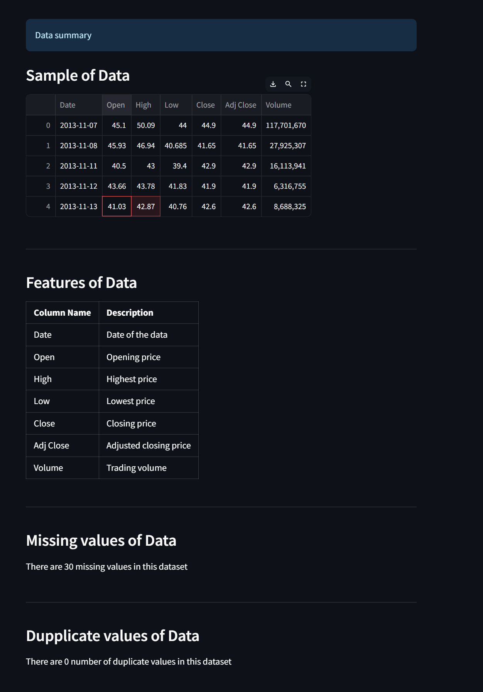
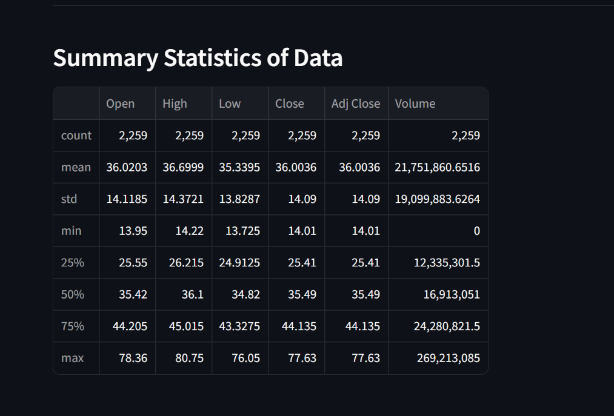
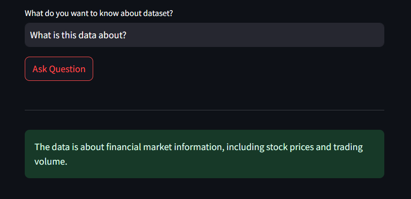
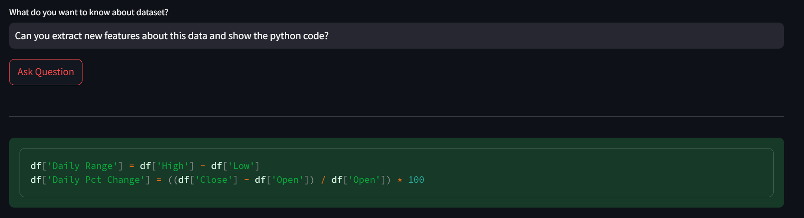

# Data Analyzer with LLM Agents

**Data Analyzer with LLM Agents** is an intelligent application designed to analyze CSV files using advanced language models. The app leverages LangChain agents in the background to enable seamless analysis and provides the flexibility to choose from a range of Large Language Models (LLMs) such as Gemini, Claude, or GPT. With this tool, you can generate descriptive statistics for any uploaded dataset, visualize columns, and even ask questions about your data—getting answers powered by LLMs.

## Features

- **LLM Selection:** Choose from models like Gemini, Claude, or GPT to power your data analysis.
- **Descriptive Statistics:** Automatically generate descriptive statistics as soon as the dataset is uploaded.
- **Column Visualization:** Plot any selected column and get insights from the LLM based on the generated graph.
- **Ask Questions:** Ask any question about your dataset, and receive insightful answers from the selected LLM.

## Screenshots




 



## Installation

1. Clone the repository:
    ```bash
    git clone https://github.com/yourusername/csv-llm-analyzer.git
    cd csv-llm-analyzer
    ```

2. Install the required packages:
    ```bash
    pip install -r requirements.txt
    ```

## Usage

1. **Upload CSV File:**
    - Upload your CSV file using the interface.
    - The app will automatically generate descriptive statistics about the dataset.


2. **Visualize Data:**
    - Select a column from your dataset to generate a plot.
    - The LLM will provide commentary based on the visualized data.

3. **Ask Questions:**
    - Use the "Ask Question" feature to ask any query regarding your dataset.
    - The selected LLM will analyze and provide detailed responses.

## License

This project is licensed under the MIT License - see the [LICENSE](LICENSE) file for details.

## Contact

For any questions or feedback, please contact [kanitvural@gmail.com](mailto:kanitvural@gmail.com).


